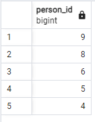

# Day 00 - Piscine SQL

## Exercise 00 - First steps into SQL world

make a select statement which returns all person's names and person's ages from the city ‘Kazan’.
```
select name, age from person
where address = 'Kazan'
```


## Exercise 01 - First steps into SQL world

make a select statement which returns names , ages for all women from the city ‘Kazan’. Yep, and please sort result by name.

```
select name, age from person
where address = 'Kazan'
order by name desc;
```


## Exercise 02 - First steps into SQL world

make 2 syntax different select statements which return a list of pizzerias (pizzeria name and rating) with rating between 3.5 and 5 points (including limit points) and ordered by pizzeria rating.
- the 1st select statement must contain comparison signs  (<=, >=)
```
select name, rating from pizzeria
where rating >= 3.5 and rating <= 5
order by rating desc
```
- the 2nd select statement must contain `BETWEEN` keyword
```
select name, rating from pizzeria
where rating between 3.5 and 5
order by rating desc
```


## Exercise 03 - First steps into SQL world

Please make a select statement which returns the person's identifiers (without duplication) who visited pizzerias in a period from 6th of January 2022 to 9th of January 2022 (including all days) or visited pizzeria with identifier 2. Also include ordering clause by person identifier in descending mode.

```
select distinct person_id from person_visits
where visit_date between '2022-01-06' and '2022-01-09'
order by person_id desc;
```




## Exercise 04 - First steps into SQL world

make a select statement which returns one calculated field with name ‘person_information’ in one string like described in the next sample:

Anna (age:16,gender:'female',address:'Moscow')

```
select 
concat(person.name, ' (age:', person.age,',gender:', person.gender, ',address:', person.address, ')')
as person_information
from person
```


## Exercise 05 - First steps into SQL world

make a select statement which returns person's names (based on internal query in `SELECT` clause) who made orders for the menu with identifiers 13 , 14 and 18 and date of orders should be equal 7th of January 2022. 

```
select name from person 
where id in (
	select person_id from person_order
	where menu_id = 13 or menu_id = 14 or menu_id = 18
	and order_date='2022-01-07'
);
```


## Exercise 06 - First steps into SQL world

use SQL construction from Exercise 05 and add a new calculated column (use column's name ‘check_name’) with a check statement (a pseudo code for this check is presented below) in the `SELECT` clause.
```
select name,
(case when name = 'Denis'
then 'true'
else 'false'
end) as check_name
from person 
where id in (
	select person_id from person_order
	where menu_id = 13 or menu_id = 14 or menu_id = 18
	and order_date='2022-01-07'
);
```


## Exercise 07 - First steps into SQL world

make a SQL statement which returns a person's identifiers, person's names and interval of person’s ages (set a name of a new calculated column as ‘interval_info’) based on pseudo code below. 

    if (age >= 10 and age <= 20) then return 'interval #1'
    else if (age > 20 and age < 24) then return 'interval #2'
    else return 'interval #3'

and yes...please sort a result by ‘interval_info’ column in ascending mode.

```
select id,
name,
case when (age >= 10 and age <= 20) then 'interval #1'
    when (age > 20 and age < 24) then 'interval #2'
    else 'interval #3' end
as interval_info from person
order by interval_info asc
```


## Exercise 08 - First steps into SQL world

make a SQL statement which returns all columns from the `person_order` table with rows whose identifier is an even number. The result have to order by returned identifier.

```
select id from person
where id%2=0
order by id asc
```


## Exercise 09 - First steps into SQL world

Please make a select statement that returns person names and pizzeria names based on the `person_visits` table with date of visit in a period from 07th of January to 09th of January 2022 (including all days) (based on internal query in `FROM` clause) .


Please take a look at the pattern of the final query.

    SELECT (...) AS person_name ,  -- this is an internal query in a main SELECT clause
            (...) AS pizzeria_name  -- this is an internal query in a main SELECT clause
    FROM (SELECT … FROM person_visits WHERE …) AS pv -- this is an internal query in a main FROM clause
    ORDER BY ...

Please add a ordering clause by person name in ascending mode and by pizzeria name in descending mode

```
SELECT (SELECT name FROM person WHERE id = pv.person_id) AS person_name,
       (SELECT name FROM pizzeria WHERE id = pv.pizzeria_id) AS pizzeria_name 
FROM (SELECT person_id, pizzeria_id 
      FROM person_visits 
      WHERE visit_date BETWEEN '2022-01-07' AND '2022-01-09') AS pv
ORDER BY person_name ASC, pizzeria_name DESC;
```
